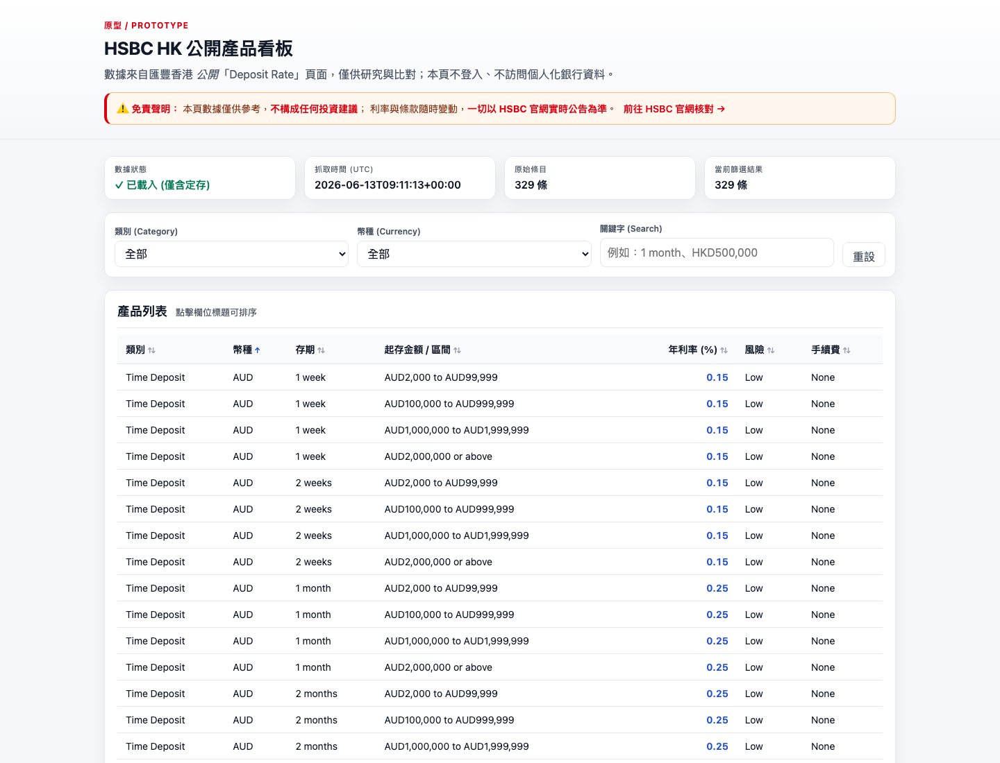

# hsbc-hk-products-dashboard

A small, static **HSBC HK public-products dashboard** — currently scoped to
**retail time deposits**. The scraper pulls publicly-listed rates from a
single HSBC HK market-information page and writes them to
`data/products.json`; a lightweight static page (`index.html` +
`assets/dashboard.{css,js}`) reads that file and renders a sortable,
filterable table.

> ⚠️ **免責聲明 / Disclaimer**
> 本看板數據僅供參考，**不構成任何投資建議**；利率與條款隨時變動，
> **一切以 HSBC 官網實時公告為準**。
> Research and prototyping only. Verify against the bank's official quote
> before any decision.

- Only publicly-accessible HSBC HK pages are accessed, at low frequency.
- **No login**, no authenticated endpoints, no user-specific quotes.
- This project must NOT be used to bypass authentication, rate limits, or
  access controls.

---

## Live demo (GitHub Pages)

After the included GitHub Actions workflow runs at least once on `main`, the
dashboard is published at:

```
https://<your-github-username>.github.io/hsbc-hk-products-dashboard/
```

See [GitHub Pages setup](#github-pages-setup) below for the one-time toggle.

---

## Recent runs

Static screenshots from local runs of the dashboard against the latest
`data/products.json`. Useful when GitHub Pages is not yet enabled (e.g. on
private repos whose plan does not support Pages) — reviewers can still see
the rendered MVP at a glance.

### 2026-06-13 — MVP (commit `bcd5f4d8`)

- Source revision: `9ee1639` (feat: static MVP dashboard + GitHub Pages workflow)
- Local server: `python -m http.server 8087` from repo root
- Screenshot tool: headless Chrome, 1440×1100 viewport
- Dataset: 329 retail time-deposit entries (`data/products.json`,
  fetched 2026-06-13T09:11:13Z)



To reproduce locally:

```bash
python3 -m http.server 8087 --bind 127.0.0.1 &
"/Applications/Google Chrome.app/Contents/MacOS/Google Chrome" \
  --headless=new --disable-gpu --hide-scrollbars \
  --window-size=1440,1100 --virtual-time-budget=4000 \
  --screenshot=docs/runs/$(date +%F)-<short-sha>.png \
  http://127.0.0.1:8087/
```

---

## Project layout

```
.
├── index.html                  # static dashboard (Pages root)
├── assets/
│   ├── dashboard.css           # styles
│   └── dashboard.js            # fetches data/products.json, filters/sorts
├── data/
│   └── products.json           # scraped time-deposit dataset (overwritten)
├── app/
│   ├── main.py                 # (legacy) FastAPI server — still works locally
│   ├── scraper.py              # scraper for the HSBC HK deposit-rate page
│   ├── templates/index.html    # (legacy) Jinja template used by FastAPI
│   └── static/style.css        # (legacy) FastAPI styling
├── requirements.txt
└── .github/workflows/pages.yml # auto-deploys static site to GitHub Pages
```

The static dashboard at the **repo root** is what GitHub Pages serves. The
`app/` FastAPI scaffold is kept for local development; the static page is
the production deliverable.

---

## Quickstart

### 1. Install Python dependencies

```bash
python3 -m venv .venv
source .venv/bin/activate          # macOS / Linux
pip install -r requirements.txt
```

### 2. (Optional) Install Playwright browser binaries

The current scraper uses `urllib + bs4` and does **not** require Playwright,
but `playwright` is pinned in `requirements.txt` for future scrapers
(funds, structured products, etc.) that need a real browser. Install the
Chromium runtime once if you want it ready:

```bash
playwright install chromium
```

### 3. Run the scraper to refresh data

```bash
python -m app.scraper
```

This rewrites `data/products.json`. Exit code `0` on success; non-zero if
the page layout changed and zero entries were parsed.

### 4. Open the local dashboard

The static dashboard is plain HTML/CSS/JS and only needs a tiny static
server (it `fetch()`s `data/products.json` over HTTP, so `file://` will not
work due to browser CORS rules):

```bash
python -m http.server 8080
# then open: http://127.0.0.1:8080/
```

You should see a table of all 329 time-deposit entries with filters for
**category** and **currency**, plus a "no data" panel calling out
funds / structured products / FX & precious metals (intentionally not
covered by this MVP).

### Optional — legacy FastAPI server

If you prefer the previous FastAPI app:

```bash
uvicorn app.main:app --reload
# then open: http://127.0.0.1:8000
```

Endpoints: `GET /` (Jinja page), `GET /health`, `GET /api/products`.

---

## GitHub Pages setup

This repo ships with `.github/workflows/pages.yml`, which builds and
deploys `index.html` + `assets/` + `data/products.json` to GitHub Pages
on every push to `main`. **One-time setup is required**:

1. On GitHub → **Settings → Pages**.
2. Under **Build and deployment → Source**, select **GitHub Actions**.
3. (Optional) Push any commit to `main` (or trigger the workflow via
   *Actions → Deploy static dashboard to GitHub Pages → Run workflow*) to
   produce the first deployment.

After the first successful run, the URL will be:

```
https://<your-github-username>.github.io/hsbc-hk-products-dashboard/
```

To keep data fresh, re-run `python -m app.scraper` and commit the updated
`data/products.json`. The workflow re-deploys automatically.

> If you prefer the classic *Deploy from a branch* mode instead, you can
> instead set **Source** to **Deploy from a branch**, branch = `main`,
> folder = `/ (root)` — the static site is already at repo root, so it
> works either way. The Actions workflow above is the recommended path
> because it gives you build logs and atomic deploys.

---

## Data shape (`data/products.json`)

```jsonc
{
  "source": "https://www.hsbc.com.hk/investments/market-information/hk/deposit-rate/",
  "disclaimer": "...",
  "fetched_at": "2026-06-13T09:11:13+00:00",
  "summary": { "count": 329, "currencies": [...], "tenors": [...] },
  "products": [
    {
      "category": "Time Deposit",
      "name": "HSBC HK Time Deposit (AUD, 1 week, AUD2,000 to AUD99,999)",
      "currency": "AUD",
      "tenor": "1 week",
      "rate": 0.15,
      "rate_unit": "percent_per_annum",
      "balance_band": "AUD2,000 to AUD99,999",
      "risk_level": "Low",
      "fee": "None",
      "source_url": "https://www.hsbc.com.hk/...",
      "fetched_at": "2026-06-13T09:11:13+00:00"
    }
  ]
}
```

The dashboard reads `products[]` and ignores any entries with missing
required fields.

---

## Current scope & non-goals

| Category                               | Status              | Reason                                                                                |
|----------------------------------------|---------------------|---------------------------------------------------------------------------------------|
| Time Deposit (retail)                  | ✅ covered (329 條) | Public, server-rendered HSBC HK page; no JS / login required.                         |
| Funds / Wealth Management              | ⛔ no data          | Listings need a logged-in client view; out of scope for an unauthenticated MVP.       |
| Structured Products / Bonds            | ⛔ no data          | Distribution is gated behind risk-assessment + auth flows; out of scope.              |
| FX / Precious Metals                   | ⛔ no data          | Live quotes come from authenticated streaming endpoints; out of scope.                |

The dashboard surfaces the "no data" categories explicitly — it does **not**
fabricate numbers for them.

---

## Endpoints (legacy FastAPI app, optional)

- `GET /` — Jinja-rendered dashboard (legacy)
- `GET /health` — `{"status": "ok"}`
- `GET /api/products` — returns the contents of `data/products.json`

The static dashboard at the repo root does not depend on these endpoints;
it reads `data/products.json` directly.
